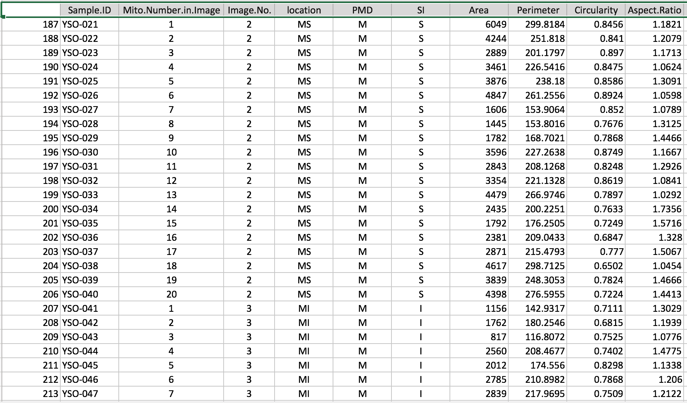
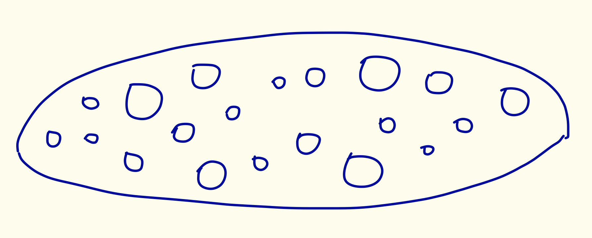

## Overview {#font-color}
1. What is Size-Biased Data? 
2. Scientific Background for Mitochondria
3. Goals for this project
4. How the sampling process caused size-biased data? 
5. Investigate Possible Estimators with simulation study
6. Use the best ones on real data
7. Conclusion
8. Future Works 

## Examples for Size-Biased Data {#font-color }
<div style="float: left; width: 50%;">
<br />

</div>
<div style="float: right; width: 50%;">
<br />

</div>

## Scientific Background for Mitochondria {#font-color}
<center>

</center>

## Goals for this project {#font-color}
1. Whether <b>Properties</b> (area, perimeter, circularity and aspect ratio) of mitochondria are different by <b>locations</b> (proximal, middle and distal end). 
2. Suggestions on <b>sampling method</b> for future research (more cells). 
<br />
<br />
<center>

</center>

## Sampling Process - 1 {#font-color}
* A young muscle fiber cell was magnifired to 166 different images by using Transmission Electron Microscope (TEM). 
<br />
<br />
<br />


## Sampling Process - 2 {#font-color}
* For each location, divide images into two groups: <br /> Subsarcolemmanl and Interfibrillar group (ignore later).
* In each group, randomly pick one image.
* In each image, sample <b>20 mitochondria</b>. 
</br><br/>
<center>

</center>

## Sampling Process - 3 {#font-color}
* Generate a list of random coordinates. 
* Pick the mitochondria whose area in the photo includes one or more generated coordinates. 
<br />
<br />
<center>

</center>

## Problems from the Sampled Data {#font-color}
1. It is <b>NOT</b> random sample but size-biased! 
2. The larger mitochondria are easier to be picked in our sample. 
3. If we used sample mean as the estimator of population mean, it will definitely be <b>overestimated</b>! 

## Raw Data
<center>

</center>
## Raw Data {#font-color}
* <b>Area $({\mu m}^{2})$:</b> <br />
  The area occupied by a mitochondrion in an image. 
* <b>Perimeter $(\mu m)$:</b> <br />
  The length of the boundary of a mitochondrion in an image.
* <b>Circularity: </b><br />
Circularity is equal to $\frac{4 \pi Area}{Perimeter^2}$. <br /> 
<p style="font-size:80%;">(Measuring the resemblance of a mitochondrion to a circle. The range of circularity is between 0 and 1.  1 means a perfect circle.) </p>
* <b>Aspect Ratio:</b> <br />
  Aspect Ratio is equal to $\frac{Length}{Width}$. <br />
  <p style="font-size:80%;">(If $AR \leq 2$, it is considered short; if $2 < AR \leq 4$, intermediate; if $AR > 4$, long.)</p>


```{r echo=FALSE, message=FALSE, warning=FALSE, results= "asis"}
library(devtools)
library(ggplot2)
library(plotly)

datt=read.csv("/Users/chou/Google Drive/UMN2014-2016/Spring2016/Plan B/final/clean_dat.csv",header=TRUE)
levels(datt$PMD)=list(P="P",M="M",D="D")
```

## Data Exploration: Area 
```{r echo=FALSE, message=FALSE, warning=FALSE, results= "asis"}
hist_PMD_a=ggplot(datt, aes(x=Area, color=PMD, fill=PMD))+
  geom_histogram(aes(y=..density..), alpha=0.5,
                 position="identity")+
  geom_density(alpha=.3)
box_PMD_a=ggplot(datt, aes(x=PMD, y=Area, fill=PMD)) + 
  geom_boxplot(outlier.shape=NA, outlier.colour = NA) +
  geom_point(position = position_jitter(h=0,w=0.3))

p1 <- plotly_build(hist_PMD_a)
p2 <- plotly_build(box_PMD_a)

p = subplot(p1,p2, margin=0.05) 

path <- file.path(getwd(), "/widget/", "area.html")
htmlwidgets::saveWidget(as_widget(p), file = path)
```
<iframe src="widget/area.html"></iframe>
  
## Data Exploration: Perimeter
```{r echo=FALSE, message=FALSE, warning=FALSE, results= "asis"}
hist_PMD_p=ggplot(datt, aes(x=Perimeter, color=PMD, 
                            fill=PMD))+ 
  geom_histogram(aes(y=..density..), alpha=0.5, 
                 position="identity")+
  geom_density(alpha=.2) 
box_PMD_p=ggplot(datt, aes(x=PMD, y=Perimeter, fill=PMD)) +
  geom_boxplot(outlier.shape=NA, outlier.colour = NA)+
  geom_point(position = position_jitter(h=0,w=0.3))

p1 <- ggplotly(hist_PMD_p)
p2 <- ggplotly(box_PMD_p)
p = subplot(p1,p2, margin=0.05) 

path <- file.path(getwd(), "/widget/", "per.html")
htmlwidgets::saveWidget(as_widget(p), file = path)
```
<iframe src="widget/per.html"></iframe>
  
## Data Exploration: Circularity
```{r echo=FALSE, message=FALSE, warning=FALSE, results= "asis"}
hist_PMD_c=ggplot(datt, aes(x=Circularity, color=PMD, 
                            fill=PMD))+ 
  geom_histogram(aes(y=..density..), alpha=0.5, 
                 position="identity")+
  geom_density(alpha=.2) 
box_PMD_c=ggplot(datt,aes(x=PMD,y=Circularity,fill=PMD)) + 
  geom_boxplot(outlier.shape=NA, outlier.colour = NA)+
  geom_point(position = position_jitter(h=0,w=0.3))

p1 <- ggplotly(hist_PMD_c)
p2 <- ggplotly(box_PMD_c)
p = subplot(p1,p2, margin=0.05) 

path <- file.path(getwd(), "/widget/", "cir.html")
htmlwidgets::saveWidget(as_widget(p), file = path)
```
<iframe src="widget/cir.html"></iframe>
  
## Data Exploration: Aspect Ratio
```{r echo=FALSE, message=FALSE, warning=FALSE, results= "asis"}
hist_PMD_ar=ggplot(datt, aes(x=Aspect.Ratio, color=PMD,
                             fill=PMD))+ 
  geom_histogram(aes(y=..density..), alpha=0.5, 
                 position="identity")+
  geom_density(alpha=.2) 

box_PMD_ar=ggplot(datt, aes(x=PMD, y=Aspect.Ratio, 
                            fill=PMD)) + 
  geom_boxplot(outlier.shape=NA, outlier.colour = NA)+
  geom_point(position = position_jitter(h=0,w=0.3))

p1 <- ggplotly(hist_PMD_ar)
p2 <- ggplotly(box_PMD_ar)
p = subplot(p1,p2, margin=0.05) 

path <- file.path(getwd(), "/widget/", "ar.html")
htmlwidgets::saveWidget(as_widget(p), file = path)
```
<iframe src="widget/ar.html"></iframe>
  
## Data Exploration: Scatter Plots
<br />
<br />
```{r echo=FALSE, message=FALSE, warning=FALSE, results= "asis", fig.width =8, fig.height=3.5}
a.per=ggplot(datt, aes(x = Area, y = Perimeter))+
  geom_point()
a.cir=ggplot(datt, aes(x = Area, y = Circularity))+
  geom_point()
a.ar=ggplot(datt, aes(x = Area, y = Aspect.Ratio))+
  geom_point()

library(grid)
library(gridExtra)
a = grid.arrange(a.per, a.cir, a.ar, ncol = 3)
```

## Best Estimators {#font-color}
* <b>Circularity:</b> <br />
  Arithmetic Mean
* <b>Aspect Ratio:</b> <br />
  Arithmetic Mean 
  
## New Goals for this project {#font-color }
1. <font color="darkred"> <b>What is the appropriate estimator for the size-biased data?</b></font> <br />
<font color="green">A: Simulation Study for finding the best estimator.</font> <br />
2. Whether Properties of mitochondria are different by locations. <br />
<font color="green">A: Permutation Test and Bootstrapping Confidence Interval </font> <br />
3. Suggestions on sampling scheme for future research. <br />
<font color="green">A: Based on the Simulation Study.</font>


## Weighted Distribution {#font-color .smaller }
<center>

</center>
* Cox (1962) proposed an idea of Weighted Distribution,
$${f}^{\ast}(x)=\frac{w(x)f(x)}{{E}_{f}(w(x))}.$$ 
* Cox (1962) also proposed that the <b>Harmonic Mean</b> ($\frac{n}{\sum_{i=1}^{n}\frac{1}{{x}_{i}}}$) as an estimator of population mean of $X$, and proved that it will converge to $\mu={E}_{f}(x)$ as $n \to \infty$, when $w(x)=x$. 


## Simulation Study - Area {#font-color}
  * Assume the true distribution, $Area\; \sim \; Exp(\theta) = f(A)$.
  * Then the observed distribution, $Area\; \sim \; Gamma(2,\theta) = f^{*}(A)$. 
  * The red dash line is $Gamma(2, \widehat{\theta}),$ where $\widehat{\theta} = \frac{\bar{a}}{2} \doteq  1183$ 
<br />
<br />
<center>

</center>


## Candidate Estimators - Area {#font-color .smaller}
  1. <b>Arithmetic Mean (AM)</b>
  $$\frac{\sum_{i=1}^{n}{a}_{i}}{n}$$
  2. <b>Weighted Mean (WM) or Harmonic Mean</b> 
  <br />
  <br />
  $$
  \frac{\sum_{i=1}^{n}{w}_{i}{a}_{i}}{\sum_{i=1}^{n}{w}_{i}}=\frac{n}{\sum_{i=1}^{n}\frac{1}{{a}_{i}}}\;,\;\;\text{where}\;\; {w}_{i}=\frac{1}{{p}_{i}}=\frac{n\bar{a}}{{a}_{i}}
  $$
  <br />
  3. <b>Maximum Likelihood Estimator (MLE)</b> 
  <br />
  <br />
  $$\frac{\sum_{i=1}^{n}{a}_{i}}{2n}=\frac{AM}{2}$$

## Simulation Study - Area (Overview) {#font-color }
* Simulate mitochondria data in a muscle fiber cell.
* Sample from <b>finite population ($\mathbf{N}$)</b> rather than infinite population. 
* Do both sampling <b>with</b> replacement and <b>without</b> replacement.
* <b>Sample size ($\mathbf{n}$)</b> is decided by the $\mathbf{Ratio}$ between $\mathbf{N}$ and $\mathbf{n}$. 
<br />
<br />
<center>

</center>
    
## Simulation Study - Area {#font-color }
1.  Assume $Area \sim Exp(\mu)$, <br />
    Set $\mu = 1000$ <br />
    $N = 2000$, <br />
    $Ratio$ = $(5\%, 10\%, 30\%, 50\%, 70\%, 95\%)$, <br />
    $Repeated\;Times = 1000$. 
2. Generate $N$ samples from $Exp(\mu)$ as subpopulation of Area <br />
    Calculate subpopulation mean, $\mu_A$, <font color="red"> (This is what we are interested in!)</font>.
3. Sample a set of samples ($n$) from subpopulation ($N$) with sampling probability proportional to the value of Area with and without replacement ($n = N \times Ratio$).

## Simulation Study - Area {#font-color }
<!-- <ol start="4" class="build"> start from the number 4 with the .build feature, knowing from checking the source code-->
<ol start="4">
  <!-- <li class="to-build"> -->
  <li> For each set of samples, calculate the candidate estimators: <b>Arithmetic Mean (AM)</b>, <b>Weighted Mean (WM)</b> and <b>Maximum Likelihood Estimator (MLE)</b>.
  <li> Repeat 3. 4. for the set $Repeated\;Times$ for each $Ratio$. </li>
  <li> Calculate the <b>Mean</b>, <b>Standard Deviation</b> and <b>Root MSE</b> for each candidate estimator. <br />
Draw plots of sampling distributions for each candidate estimator. </li>
</ol>

## Results of Simulation Study - Area {#font-color}
<center>

</cetner>

## Best Estimators - Area {#font-color}
* <b>Sampling "WITH" Replacement:</b> <br />
  <font color="green">Weighted Mean and MLE</font>
  <br />
* <b>Sampling "WITHOUT" Replacement: </b><br />
  <font color="green">Unfortunately, not clear yet. </font>

## Simulation Study - Perimeter {#font-color .smaller}
* $Perimeter =\sqrt{4\pi}\sqrt{\frac{Area}{Circularity}}$
* $Area \perp Circularity$. 
* The observed distribution of $Circularity\;\sim\;Beta(15,5)$. 
* Assume that the true distribution of  $Circularity\;\sim\;Beta(\alpha=15, \beta=5)$. 
* The red dash line is $Beta(15, 5)$. 
<br />
<br />
<br />
<center>

</center>

## Candidate Estimators - Perimeter {#font-color .smaller}
  1. <b>Arithmetic Mean (AM)</b>
  $$\frac{\sum_{i=1}^{n}{p}_{i}}{n}$$
  2. <b>Weighted Mean (WM)</b>
$$\frac{\sum_{i=1}^{n}{w}_{i}{p}_{i}}{\sum_{i=1}^{n}{w}_{i}}\;,\;\;\text{where}\;\; {w}_{i}=\frac{n\bar{a}}{{a}_{i}}$$
  3. <b>Delta Method Esitmator (DME)</b>
$$\sqrt{4\pi}\sqrt{\frac{\bar{a}/2}{\bar{c}}}$$
  4. <b>2nd Order Taylor's Approximation Estimator (2TAE)</b>
$$\sqrt{4 \pi}\left[ \sqrt{\frac{\bar{a}/2}{\bar{c}}} - \frac{1}{8} (\frac{\bar{a}}{2})^\frac{-3}{2}(\bar{c})^\frac{-1}{2}\frac{{s}_{a}^2}{2}+\frac{3}{8}(\frac{\bar{c}}{2})^\frac{1}{2}(\bar{c})^\frac{-5}{2}{s}_{c}^2\right]$$


## Simulation Study - Perimeter {#font-color } 
1. Generate the <b>finite subpopulation ($\mathbf{N}$)</b> data from $Circularity \sim Beta(15,5)$. 
2. Plug the generated Area and Circularity data into formula to obtain subpopulation of Perimeter.  
3. Sample from the finite subpopulation ($N$) of Perimeter with sampling probability proportional to Area with and without replacement.
4. See the performance of the candidates estimators: 
<b>Arithmetic Mean (AM)</b>, <b>Weighted Mean (WM)</b>, 
<b>Delta Method Esitmator (DME)</b>, <b>2nd Order Taylor's Approximation Estimator (2TAE)</b>. 

## Simulated Data - Perimeter {#font-color } 
<center>
```{r echo=FALSE, message=FALSE, warning=FALSE, results= "asis", fig.width = 8, fig.height= 5.5}
library(ggplot2)
a.per=ggplot(datt, aes(x = Area, y = Perimeter))+
  geom_point()
a.cir=ggplot(datt, aes(x = Area, y = Circularity))+
  geom_point()

mean.size=1000
N=2000
n=120
sh1=15
sh2=5

set.seed(12345)
sub.pop.area=rexp(N,rate=1/mean.size)
sub.pop.cir=rbeta(length(sub.pop.area),shape1=sh1,shape2=sh2)
sub.pop.per=sqrt(4*pi)*sqrt(sub.pop.area/sub.pop.cir)
true.mean.per=mean(sub.pop.per)

sim.data=data.frame(sub.pop.area,sub.pop.per,sub.pop.cir)
sample=sim.data[sample(1:dim(sim.data)[1],n,prob=sim.data[,1],replace=TRUE),]

a.per_sim=ggplot(sample, aes(x = sub.pop.area, y = sub.pop.per))+geom_point() + labs(x = "simulated_Area", y = "simulated_Perimeter") 
a.cir_sim=ggplot(sample, aes(x = sub.pop.area, y = sub.pop.cir))+geom_point() + labs(x = "simulated_Area", y = "simulated_Circularity") 

library(grid)
library(gridExtra)
a = grid.arrange(a.cir, a.cir_sim, a.per, a.per_sim, ncol = 2)
```
</center>


## Results of Simulation Study - Perimeter {#font-color}
<center>

</center>

## Best Estimators - Perimeter {#font-color}
* <b>Sampling "WITH" Replacement: </b><br />
  <font color="green">Weighted Mean and 2TAE</font>
  <br />
* <b>Sampling "WITHOUT" Replacement:</b> <br />
  <font color="green">Unfortunately, not clear yet. </font>

## Hypothesis Test {#font-color}
  * <b>Overall Hypothesis Test: </b>

$$
\begin{align*}
  {H}_{0} &: {\mu}_{{i}_{P}} = {\mu}_{{i}_{M}} = {\mu}_{{i}_{D}}\\
  {H}_{A} &: \text{At least one} \: {\mu}_{{i}_{j}} \neq  {\mu}_{{i}_{k}}
\end{align*}
$$
  
  * <b>Pairwise Comparison Test: </b>

$$
\begin{align*}
    {H}_{0} &: {\mu}_{{i}_{j}} = {\mu}_{{i}_{k}} \\
    {H}_{A} &: {\mu}_{{i}_{j}} \neq  {\mu}_{{i}_{k}} \\
\end{align*}
$$
$$
\begin{align*}
  i &= \left \{ \text{Area, Perimeter, Circularity, Aspect Ratio} \right \} \\
  j,k & = \left \{ \text{P, M, D} \right \} 
\end{align*}
$$

## Hypothesis Test : Permutation Test {#font-color .smaller}
* <b>Reasons: </b>
  <ul>
    <li> Area and Perimeter are size-biased. </li>
    <li> Circularity and Aspect Ratio, the data violated the normality assumption of ANOVA and T-test. </li> 
  </ul>
  <br />
* <b>Overall Test (Permutation Test of ANOVA): </b> 
  <ul>
    <li>
      $\sum_{i=\left\{P,M,D\right\}}{(\widehat{{\mu}_{i}}-\widehat{{\mu}})}^{2}$</li>
    <li> significance level = $5\%$ </li>
  </ul>
  <br />
* <b>Pairwise Comparison Test (Permutation Test of T-test):</b> 
  <ul>
    <li>
      $\widehat{\mu}_{i}-\widehat{\mu}_{j}$, where $i=\left \{P,M,D\right\}$</li>
    <li> Bonferroni’s correction:
    significance level = $\frac{5\%}{3} = 0.0167$.</li>
  </ul>
  
## Results for the Hypothesis Test 
<center>

</center>
  
## Bootstrapping CI for Means
<center>

</center>
<center>

</center>

## Bootstrapping CI for the differences
<center>

</center>
<center>

</center>

## Conclusions {#font-color  .smaller}
1. <b>Middle part and Proximal part</b> of the muscle fiber cell have significantly large Area, Perimeter and Circularity. <br />
  <ul>
      <li> Area: $\underline{M > P} > D$ </ui> 
      <li> Perimeter: $\underline{M > P} > D$ </li>
      <li> Circularity: $\underline{M > P} > D$ & $M > \underline{P > D}$</li>
      <li> Aspect Ratio: $\underline{P > D > M}$ </li>
  </ul>
    <br />
2. The appropriate estimator for the size-biased data is <b>Non-parametric Weighted Mean</b>. <br /><br />
3. Suggest to use <b>Sampling With Replacement (SWR)</b> rather than Sampling Without Replacement (SWOR) in their future sampling scheme. 

## Future Work {#font-color }
* Find the best estimator for SWOR. 
* Robustness of the distribution assumptions can be an interesting topic. <br />
  The Nonparametric Weighted Mean had notably different results with the Parametric Estimators (MLE for Area and 2TAE for Perimeter). Maybe it is because of improper distribution assumptions on Area and Circularity.  
* Include the effect of Subsarcolemmanl and Interfibrillar group and even possible interaction. 

## References {#font-color}
* Bratic, Ana and Larsson, Nils-Gran. “The Role of Mitochondria in Aging.” Journal of Clinical Investigation 123, no. 3 (2013): 951-57. 
* Cox, D. R. Renewal Theory. London: Methuen, 1962.
* Patil,G. P. and Ord,J. K. “On Size-Biased Sampling and Related Form-Invariant Weighted Dis-
tributions.” Sankhya. Series B 38,48-61.
* Jones, M. C. “Kernel Density Estimation for Length Biased Data.” Biometrika. Vol. 78, No. 3 (Sep., 1991), pp. 511-519

## Photos {#font-color }
* Fishing Net: <br /> [https://learning.blogs.nytimes.com/2012/04/19/poetry-pairing-trout/comment-page-1/?_r=0](https://learning.blogs.nytimes.com/2012/04/19/poetry-pairing-trout/comment-page-1/?_r=0)
* Mall: <br />
[https://www.123rf.com/photo_30920353_people-in-shopping-mall-in-sofia-bulgaria.html]()https://www.123rf.com/photo_30920353_people-in-shopping-mall-in-sofia-bulgaria.html
* Muscle: <br />
[http://slideplayer.com/slide/9024081/](http://slideplayer.com/slide/9024081/)

## The end 
<br />
<center>

</center>
<font size="2">photo from  [http://www.desicomments.com/desi/thank-you/](http://www.desicomments.com/desi/thank-you/)</font>

## Questions?
<br />
<center>

</center>
<font size="2">photo from  [http://www.bookcovercafe.com/independent-publishing-q-and-a-series-01/](http://www.bookcovercafe.com/independent-publishing-q-and-a-series-01/)</font>