## Overview {#font-color .smaller}
1. What is Size-Biased Data? 
2. Scientific Background for Mitochondria
3. Goals for this project
4. How the sampling process caused size-biased data? 
5. Best Estimator <br />
    * Simulation Study
6. Hypothesis Test and Confidence Interval <br />
    * Permutation Hypothesis Test 
    * Boostrapping Confidence Interval 
7. Conclusion
8. Discussion 

## Story about Size-Biased Data {#font-color .build}
<div style="float: left; width: 50%;">
<br />

</div>
<div style="float: right; width: 50%;">
<br />
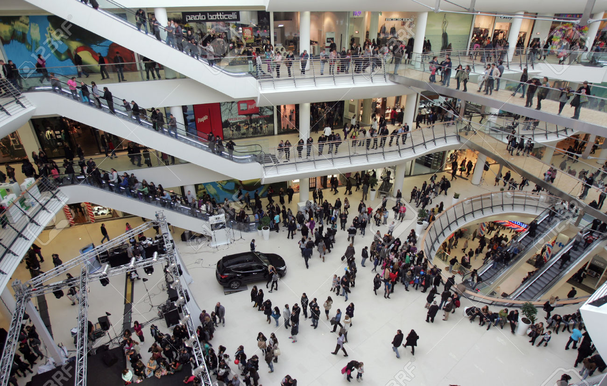
</div>

## Scientific Background for Mitochondria {#font-color .build}
<center>
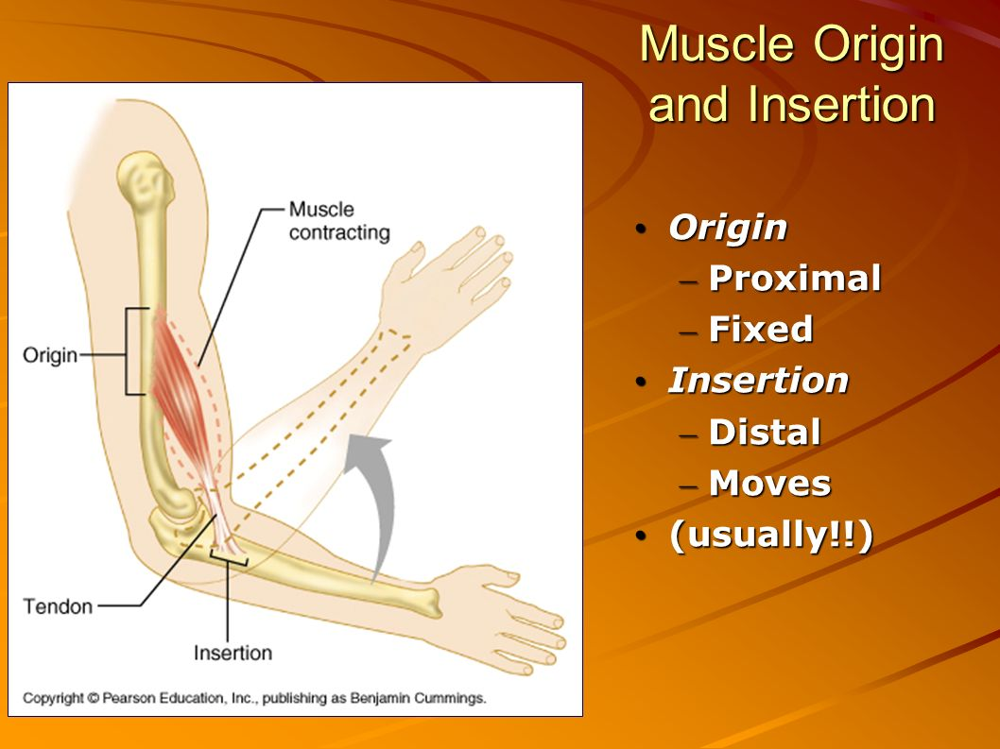
</center>

## Goals for this project {#font-color .build}
> 1. Whether <b>Properties</b> (area, perimeter, circularity and aspect ratio) of mitochondria are different by <b>locations</b> (proximal, middle and distal end). 
> 2. Suggestions on <b>sampling method</b> for future research (more cells). 
<br />
<br />
<center>
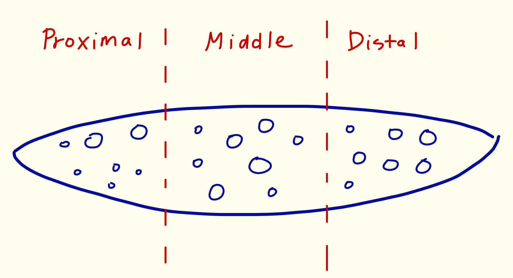
</center>

## Sampling Process - 1 {#font-color}
* A young muscle fiber cell was magnifired to 166 different images by using Transmission Electron Microscope (TEM). 
* Those falls in <b>" { "</b> are defined as beging in <b>Proximal end</b>, <br /> in <b>" [ "</b> are being in <b>Distal end</b>, and the rest are being in <b>Middle part</b>.
<br />
<br />
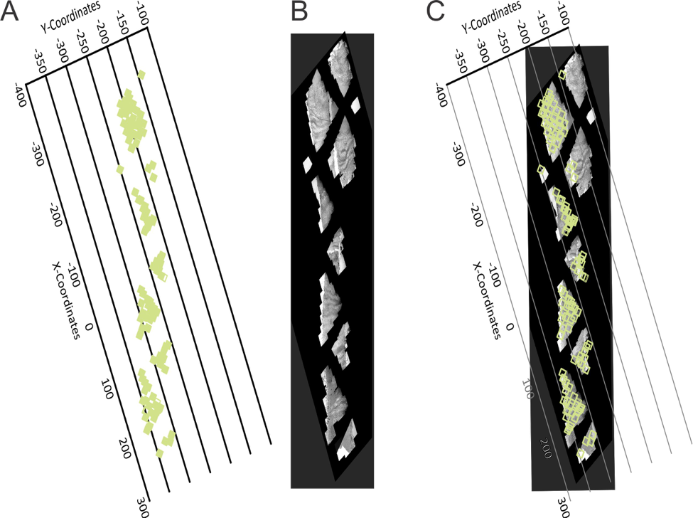
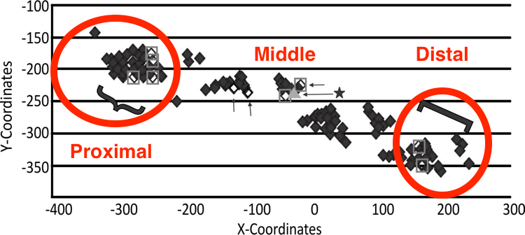

## Sampling Process - 2 {#font-color}
* For each location, divide images into two groups: Subsarcolemmanl and Interfibrillar group. 
* In each group, randomly pick one image.
* In each image, randomly pick <b>20 mitochondria</b>. 
</br><br/>
<center>
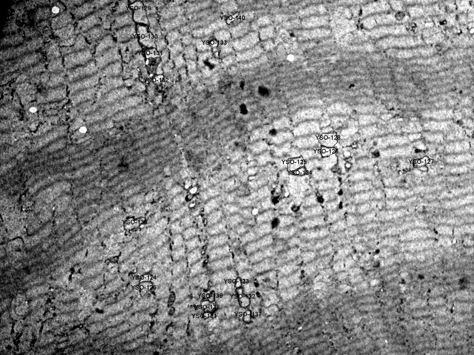
</center>

## Sampling Process - 3 {#font-color}
* Generate a list of random coordinates. 
* Pick the mitochondria whose area in the photo includes one or more generated coordinates. 
<br />
<br />
<center>
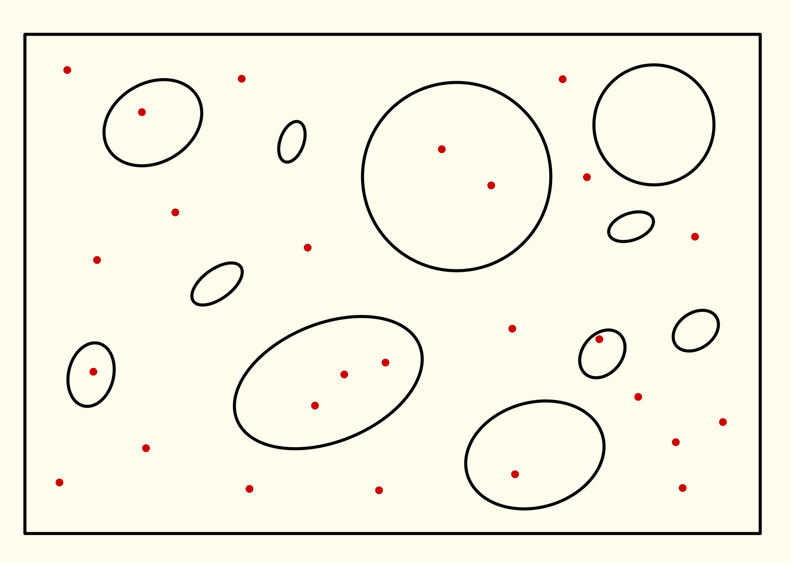
</center>

## Raw Data 
```{r, echo=FALSE, message=FALSE, warning=FALSE, results= "asis"}
library(devtools)
library(ggplot2)
library(plotly)
library(DT)

datt=read.csv("/Users/chou/Google Drive/UMN2014-2016/Spring2016/Plan B/final/clean_dat.csv",header=TRUE)
dat = datt[,-c(1,4,5)]
dat = dat[,c(1,3,2,4:11)]
names(dat) = c("Sample ID", "image No.", "# in image",
                "image name", "location", "PMD", "SI", 
                "Area", "Perimeter", "Circularity",
                "Aspect Ratio")
d=datatable(dat, options = list( 
  searching = FALSE,
  autoWidth = TRUE,
  initComplete = JS(
    "function(settings, json) {",
    "$(this.api().table().header()).css({'background-color': '#000', 'color': '#fff'});","}")
))
path <- file.path(getwd(), "/widget/", "dat.html")
htmlwidgets::saveWidget(as_widget(d), file = path)
```
<iframe src="widget/dat.html"></iframe>


## Raw Data {#font-color}
* <b>Area $({\mu m}^{2})$:</b> <br />
  The area occupied by a mitochondrion in an image. 
* <b>Perimeter $(\mu m)$:</b> <br />
  The length of the boundary of a mitochondrion in an image.
* <b>Circularity: </b><br />
Circularity is equal to $\frac{4 \pi Area}{Perimeter^2}$. <br /> 
<p style="font-size:80%;">(Measuring the resemblance of a mitochondrion to a circle. The range of circularity is between 0 and 1.  1 means a perfect circle.) </p>
* <b>Aspect Ratio:</b> <br />
  Aspect Ratio is equal to $\frac{Length}{Width}$. <br />
  <p style="font-size:80%;">(If $AR \leq 2$, it is considered short; if $2 < AR \leq 4$, intermediate; if $AR > 4$, long.)</p>


## Problems from the Sampled Data {#font-color .build}
> 1. It is not random sample but size-biased! 
> 2. The larger mitochondria are easier to be picked in our sample. 
> 3. If we used sample mean as our population mean estimator, it will definitely be overestimated! 


## New Goals for this project {#font-color .build}
> 1. <font color="darkred"> <b>What is the appropriate estimator for the size-biased data?</b> </font> 
2. Whether Properties of mitochondria are different by locations.
3. Suggestions on sampling scheme for future research.

## New Goals for this project {#font-color .build}
> 1. <font color="darkred"> <b>What is the appropriate estimator for the size-biased data?</b></font> <br />
<font color="green">A: Simulation Study.</font> <br />
> 2. Whether Properties of mitochondria are different by locations. <br />
<font color="green">A: Permutation Test and Bootstrapping Confidence Interval </font> <br />
> 3. Suggestions on sampling scheme for future research. <br />
<font color="green">A: Based on the Simulation Study.</font>

## Data Exploration: Area 
```{r echo=FALSE, message=FALSE, warning=FALSE, results= "asis"}
hist_PMD_a=ggplot(datt, aes(x=Area, color=PMD, fill=PMD))+
  geom_histogram(aes(y=..density..), alpha=0.5,
                 position="identity")+
  geom_density(alpha=.3)
box_PMD_a=ggplot(datt, aes(x=PMD, y=Area, fill=PMD)) + 
  geom_boxplot() +
  geom_point(position = position_jitter(h=0,w=0.3))

p1 <- ggplotly(hist_PMD_a)
p2 <- ggplotly(box_PMD_a)
p = subplot(p1,p2, margin=0.05) 

path <- file.path(getwd(), "/widget/", "area.html")
htmlwidgets::saveWidget(as_widget(p), file = path)
```
<iframe src="widget/area.html"></iframe>
  
## Data Exploration: Perimeter
```{r echo=FALSE, message=FALSE, warning=FALSE, results= "asis"}
hist_PMD_p=ggplot(datt, aes(x=Perimeter, color=PMD, 
                            fill=PMD))+ 
  geom_histogram(aes(y=..density..), alpha=0.5, 
                 position="identity")+
  geom_density(alpha=.2) 
box_PMD_p=ggplot(datt, aes(x=PMD, y=Perimeter, fill=PMD)) +
  geom_boxplot()+
  geom_point(position = position_jitter(h=0,w=0.3))

p1 <- ggplotly(hist_PMD_p)
p2 <- ggplotly(box_PMD_p)
p = subplot(p1,p2, margin=0.05) 

path <- file.path(getwd(), "/widget/", "per.html")
htmlwidgets::saveWidget(as_widget(p), file = path)
```
<iframe src="widget/per.html"></iframe>
  
## Data Exploration: Circularity
```{r echo=FALSE, message=FALSE, warning=FALSE, results= "asis"}
hist_PMD_c=ggplot(datt, aes(x=Circularity, color=PMD, 
                            fill=PMD))+ 
  geom_histogram(aes(y=..density..), alpha=0.5, 
                 position="identity")+
  geom_density(alpha=.2) 
box_PMD_c=ggplot(datt,aes(x=PMD,y=Circularity,fill=PMD)) + 
  geom_boxplot()+
  geom_point(position = position_jitter(h=0,w=0.3))

p1 <- ggplotly(hist_PMD_c)
p2 <- ggplotly(box_PMD_c)
p = subplot(p1,p2, margin=0.05) 

path <- file.path(getwd(), "/widget/", "cir.html")
htmlwidgets::saveWidget(as_widget(p), file = path)
```
<iframe src="widget/cir.html"></iframe>
  
## Data Exploration: Aspect Ratio
```{r echo=FALSE, message=FALSE, warning=FALSE, results= "asis"}
hist_PMD_ar=ggplot(datt, aes(x=Aspect.Ratio, color=PMD,
                             fill=PMD))+ 
  geom_histogram(aes(y=..density..), alpha=0.5, 
                 position="identity")+
  geom_density(alpha=.2) 

box_PMD_ar=ggplot(datt, aes(x=PMD, y=Aspect.Ratio, 
                            fill=PMD)) + 
  geom_boxplot()+
  geom_point(position = position_jitter(h=0,w=0.3))

p1 <- ggplotly(hist_PMD_ar)
p2 <- ggplotly(box_PMD_ar)
p = subplot(p1,p2, margin=0.05) 

path <- file.path(getwd(), "/widget/", "ar.html")
htmlwidgets::saveWidget(as_widget(p), file = path)
```
<iframe src="widget/ar.html"></iframe>

## Data Exploration: Scatter Plots
```{r echo=FALSE, message=FALSE, warning=FALSE, results= "asis"}
a.per=ggplot(datt, aes(x = Area, y = Perimeter))+
  geom_point()
a.cir=ggplot(datt, aes(x = Area, y = Circularity))+
  geom_point()
a.ar=ggplot(datt, aes(x = Area, y = Aspect.Ratio))+
  geom_point()

s = subplot(ggplotly(a.per), ggplotly(a.cir), 
            ggplotly(a.ar), shareX = TRUE, titleY=TRUE, 
            margin = 0.05)
path <- file.path(getwd(), "/widget/", "scatter.html")
htmlwidgets::saveWidget(as_widget(s), file = path)
```
<iframe src="widget/scatter.html"></iframe>

## Weighted Distribution {#font-color .smaller}
* Cox (1962) proposed an idea of Weighted Distribution,
$${f}^{\ast}(x)=\frac{w(x)f(x)}{{E}_{f}(w(x))}$$
* Cox (1962) also proposed the Harmonic Mean ($\frac{n}{\sum_{i=1}^{n}\frac{1}{{x}_{i}}}$) as an estimator of population mean of $X$, and proved that it will converge to $\mu={E}_{f}(x)$ as $n \to \infty$.
<br />
<br />
<br />
<center>
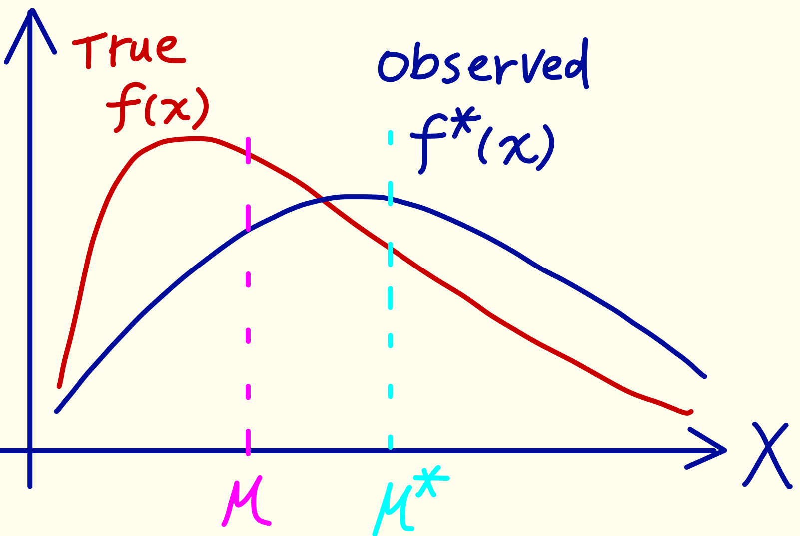
</center>

## Simulation Study - Area {#font-color}
  * Suppose that the true distribution of  $Area\;\sim\;Exp(\theta)$.
  * The observed distribution of $Area\;\sim\;Gamma(2,\theta)$. 
  * The red dash line is $Gamma(2, \widehat{\theta}),$ where $\widehat{\theta} = \bar{a} = 1183$ 
<br />
<br />
<br />
<center>
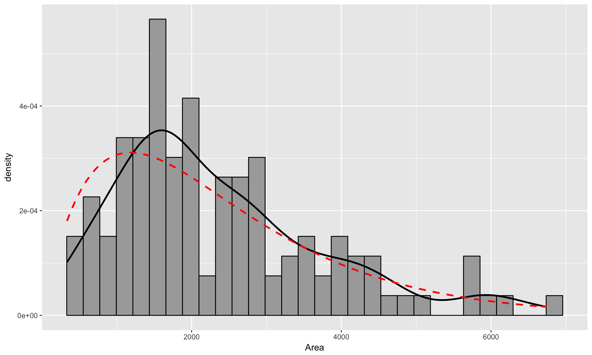
</center>


## Candidate Estimators - Area {#font-color .smaller}
  1. Arithmetic Mean (AM) $$\frac{\sum_{i=1}^{n}{a}_{i}}{n}$$
  2. Weighted Mean (WM) or Harmonic Mean
  $$\frac{\sum_{i=1}^{n}{w}_{i}{a}_{i}}{\sum_{i=1}^{n}{w}_{i}}=\frac{n}{\sum_{i=1}^{n}\frac{1}{{a}_{i}}}\;,\;\;\text{where}\;\; {w}_{i}=\frac{1}{{p}_{i}}=\frac{n\bar{a}}{{a}_{i}}$$
  3. Maxima Likelihood Estimator (MLE) 
$$\frac{\sum_{i=1}^{n}{a}_{i}}{2n}=\frac{AM}{2}$$


## Simulation Study - Area {#font-color .build}
> 1. Set $N = 2000$; Ratio between $N$ and $n$ are $(5\%, 10\%, 30\%, 50\%, 70\%, 95\%)$; $Repeated\;Times = 1000$ and $\mu = 1000$.
> 2. Generate $N$ samples from $Exp(\mu)$ as subpopulation of Area and calculate subpopulation mean, $\mu_A$, as the known parameter.
> 3. Sample a set of samples with size $n$ from subpopulation with sampling probability proportional to the value of Area with and without replacement. $n$ is the product of $N$ and a certain $Ratio$.

## Simulation Study - Area {#font-color }
<ol start="4" class="build">
  <li class="to-build"> For each set of samples, calculate the candidate estimators: Arithmetic Mean (AM), Weighted Mean (WM) and Maximum Likelihood Estimator (MLE).
  <li class="to-build"> Repeat 3. 4. for the set $Repeated\;Times$ for each $Ratio$. </li>
  <li class="to-build"> Calculate the Mean, Standard Deviation and Root MSE for each candidate estimator. Also
draw plots of sampling distributions for each candidate estimator. </li>
</ol>

## Results of Simulation Study - Area {#font-color}
<center>
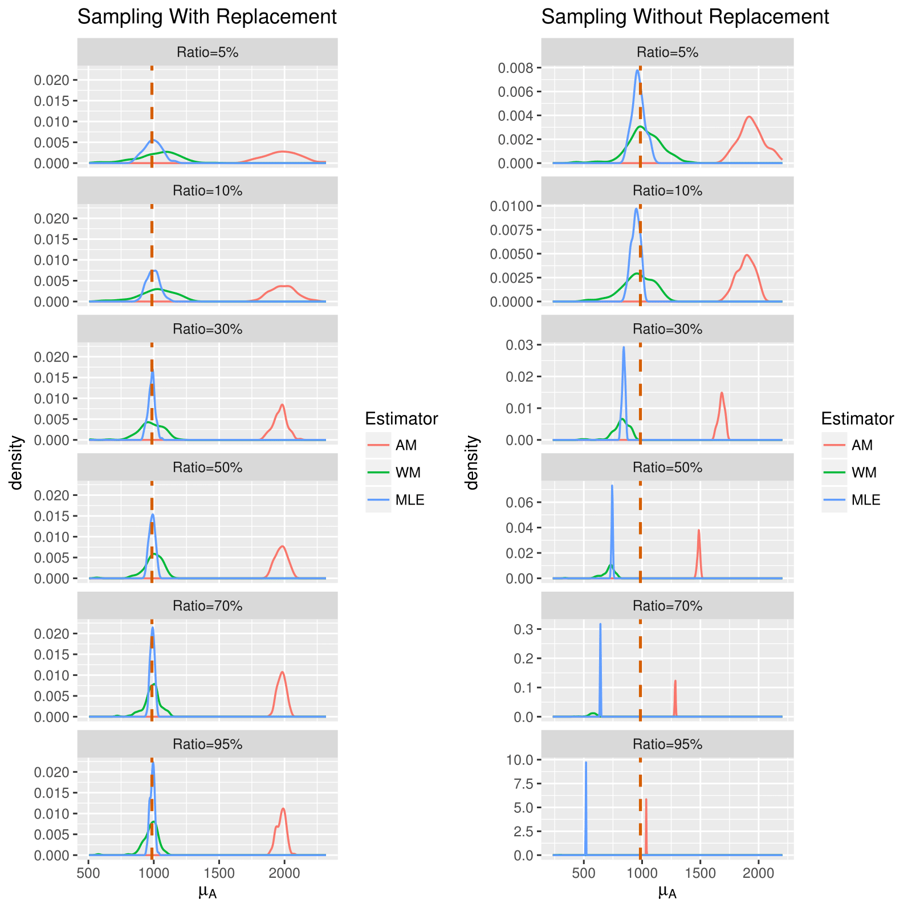
</cetner>

## Best Estimators {#font-color}
* <b>Area:</b> <br />
  Weighted Mean and MLE. 

## Simulation Study - Perimeter {#font-color .smaller}
* Area is independent to Circularity. 
* Perimeter$=\sqrt{4\pi}\sqrt{\frac{\text{Area}}{\text{Circularity}}}$
* Suppose that the true distribution of  $Circularity\;\sim\;Beta(\alpha, \beta)$. 
* The observed distribution of $Circularity\;\sim\;Beta(15,5)$. 
* The red dash line is $Beta(15, 5)$. 
<br />
<br />
<br />
<center>

</center>

## Candidate Estimators - Perimeter {#font-color .smaller}
  1. Arithmetic Mean (AM)
  $$\frac{\sum_{i=1}^{n}{p}_{i}}{n}$$
  2. Weighted Mean (WM)
$$\frac{\sum_{i=1}^{n}{w}_{i}{p}_{i}}{\sum_{i=1}^{n}{w}_{i}}\;,\;\;\text{where}\;\; {w}_{i}=\frac{n\bar{a}}{{a}_{i}}$$
  3. Delta Method Esitmator (DME)
$$\sqrt{4\pi}\sqrt{\frac{\bar{a}/2}{\bar{c}}}$$
  4. 2nd Order Taylor's Approximation Estimator (2TAE)
$$\sqrt{4 \pi}\left[ \sqrt{\frac{\bar{a}/2}{\bar{c}}} - \frac{1}{8} (\frac{\bar{a}}{2})^\frac{-3}{2}(\bar{c})^\frac{-1}{2}\frac{{s}_{a}^2}{2}+\frac{3}{8}(\frac{\bar{c}}{2})^\frac{1}{2}(\bar{c})^\frac{-5}{2}{s}_{c}^2\right]$$

## Simulation Study - Perimeter {#font-color .build}
> 1. Set $N = 2000$; $Ratio$ between $N$ and $n$ are $(5%, 10%, 30%, 50%, 70%, 95%)$; $Repeated\;Times = 1000$ and $\mu = 1000$.
> 2. Generate $N$ samples from $Exp(\mu)$ distribution as subpopulation of Area and $N$ samples from $Beta(\alpha, \beta)$ as subpopulation of Circularity. $\alpha$ and $\beta$ are set to be 15 and 5 by observing the data we have.
> 3. Plug the generated $N$ elements of Area and $N$ elements of Circularity into the formula, $\text{Perimeter}=\sqrt{4\pi}\sqrt{\frac{\text{Area}}{\text{Circularity}}}$, and obtain $N$ elements of Perimeter. Calculate the mean of
$N$ elements of Perimeter, ${\mu}_{P}$, and treat it as the true mean of Perimeter.

## Simulation Study - Perimeter {#font-color .build}
<ol start="4" class="build">
  <li class="to-build">Sample a set of samples with size $n$ from subpopulation of Perimeter with sampling probability proportional to Area with and without replacement. $n$ is the product of $N$ and a certain $Ratio$.</li>
  <li class="to-build">For each set of samples, calculate the candidate estimators: Arithmetic Mean (AM), Weighted Mean (WM), Delta Method Estimator (DME), 2nd Order Taylor’s Approximation Estimator (2TAE). </li>
  <li class="to-build">Repeat 3. 4. for the set $Repeated\;Times$ for each $Ratio$.</li>
  <li class="to-build">Calculate the Mean, Standard Deviation and Root MSE for each candidate estimator. Also
draw plots of sampling distributions for each candidate estimator.</li>
</ol>

## Results of Simulation Study - Perimeter {#font-color}
<center>
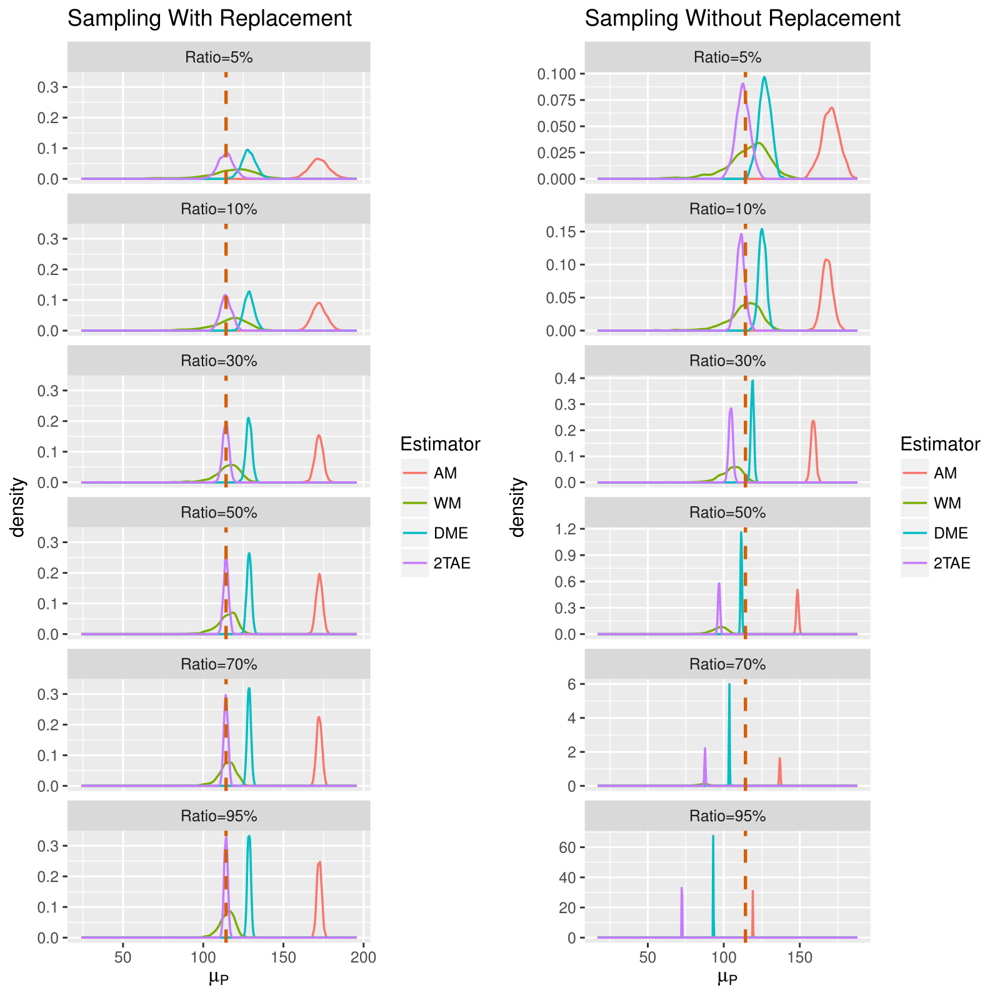
</center>

## Best Estimators {#font-color .build}
> * <b>Area:</b> <br />
  Weighted Mean and MLE. 
> * <b>Perimeter: </b> <br />
  Weighted Mean and 2TAE. 
> * <b>Circularity: </b> <br />
  Arithmetic Mean (because it is independent to Area)
> * <b>Aspect Ratio: </b> <br />
  Arithmetic Mean (because it is independent to Area)
  
## Hypothesis Test {#font-color}
  * <b>Overall Hypothesis Test: </b>

$$
\begin{align*}
  {H}_{0} &: {\mu}_{{i}_{P}} = {\mu}_{{i}_{M}} = {\mu}_{{i}_{D}}\\
  {H}_{A} &: \text{At least one} \: {\mu}_{{i}_{j}} \neq  {\mu}_{{i}_{k}}
\end{align*}
$$
  
  * <b>Pairwise Comparison Test: </b>

$$
\begin{align*}
    {H}_{0} &: {\mu}_{{i}_{j}} = {\mu}_{{i}_{k}} \\
    {H}_{A} &: {\mu}_{{i}_{j}} \neq  {\mu}_{{i}_{k}} \\
\end{align*}
$$
$$
\begin{align*}
  i &= \left \{ \text{Area, Perimeter, Circularity, Aspect Ratio} \right \} \\
  j,k & = \left \{ \text{P, M, D} \right \} 
\end{align*}
$$

## Hypothesis Test : Permutation Test {#font-color}
  * <b>Reasons: </b>
    * Area and Perimeter are size-biased. 
    * Circularity and Aspect Ratio, the data violated the normality assumption of ANOVA and T-test. 

  * <b>Overall Test (Permutation Test of ANOVA): </b>
    * significance level = $5\%$
  * <b>Pairwsie Comparison Test (Permutation Test of T-test):</b>
    * Bonferroni’s correction, for its easy interpretation and its simultaneous confidence interval for the mean differences.
    * significance level = $\frac{5\%}{3} = 0.0167$ 
  
## Results for the Hypothesis Test 
<center>
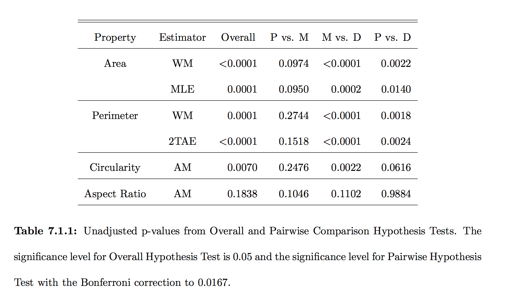
</center>
  
## Bootstrapping CI for Means
<center>
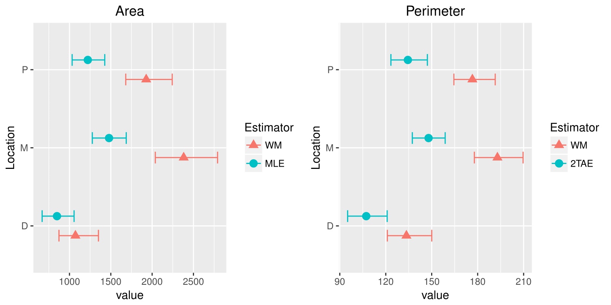
</center>
<center>
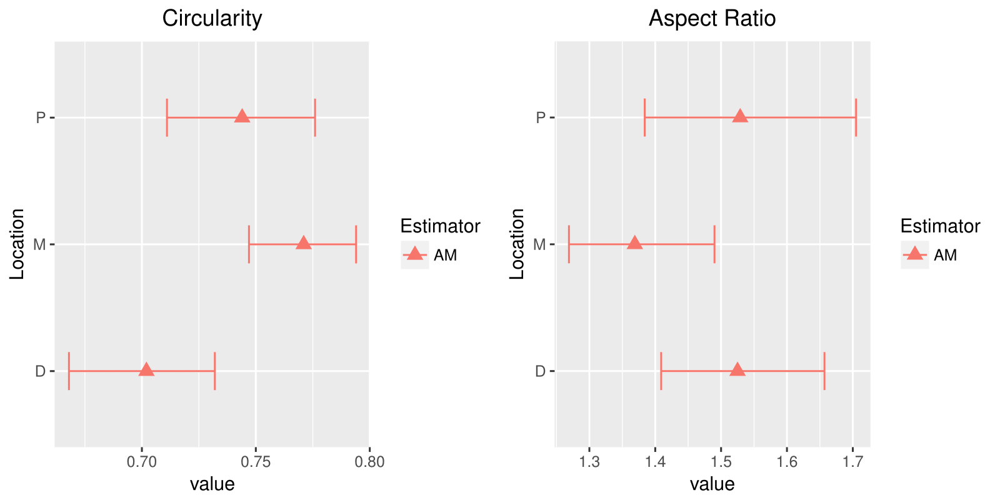
</center>

## Bootstrapping CI for the differences
<center>
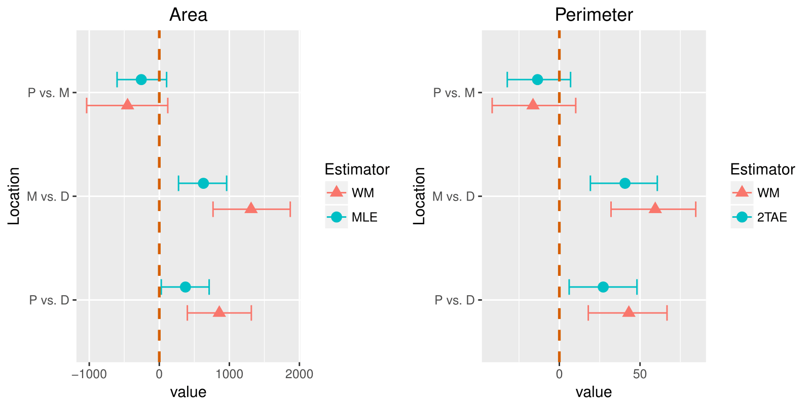
</center>
<center>
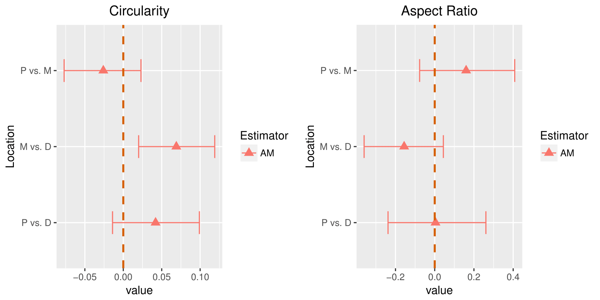
</center>

## Conclusions {#font-color .build .smaller}
> 1. What is the appropriate estimator for the size-biased data? <br />
  <font color="green">A: Use Nonparametric Weighted Mean as the best estimator for population mean and do hypothesis test based on this estimator. (because of none distribution assumptions)</font>
> 2. Whether Properties (Area, Perimeter, Circularity, Aspect Ratio)of mitochondria are different by locations. <br />
  <font color="green">A: Middle part of the muscle fiber cell have larger Area, Perimeter and Circularity which means to support muscle contraction more energy is needed in Middle.</font>
> 3. Suggestions on sampling scheme for future research. <br />
  <font color="green">A: Sampling With Replacement(SWR) rather than Sampling Without Replacement(SWOR) in their sampling scheme because as we can see in the Simulation section the performance of Weighted Mean is not desirable when the case is SWOR unless they can assure the Ratio between population and samples are around 10% or less.</font>
  
## Discussion {#font-color .build}
> * Finding the best estimator for SWOR is a potential area for future work.
> * We expect Nonparametric Weighted Mean should have similar results with the Parametric Estimators (MLE for Area and 2TAE for Perimeter) but wider confidence interval for the Nonparametric Weighted Mean. However, in our data, things are not like what we expected. 
> * Maybe it is because of improper distribution assumptions on Area and Circularity. Hence, in the future the robustness of the distribution assumptions can be an interesting topic to work on too.
  
## References {#font-color}
* Bratic, Ana and Larsson, Nils-Gran. “The Role of Mitochondria in Aging.” Journal of Clinical Investigation 123, no. 3 (2013): 951-57. 
* Cox, D. R. Renewal Theory. London: Methuen, 1962.
* Patil,G. P. and Ord,J. K. “On Size-Biased Sampling and Related Form-Invariant Weighted Dis-
tributions.” Sankhya. Series B 38,48-61.
* Jones, M. C. “Kernel Density Estimation for Length Biased Data.” Biometrika. Vol. 78, No. 3 (Sep., 1991), pp. 511-519

## Photos {#font-color }
* Fishing Net: <br /> [https://learning.blogs.nytimes.com/2012/04/19/poetry-pairing-trout/comment-page-1/?_r=0](https://learning.blogs.nytimes.com/2012/04/19/poetry-pairing-trout/comment-page-1/?_r=0)
* Mall: <br />
[https://www.123rf.com/photo_30920353_people-in-shopping-mall-in-sofia-bulgaria.html]()https://www.123rf.com/photo_30920353_people-in-shopping-mall-in-sofia-bulgaria.html
* Muscle: <br />
[http://slideplayer.com/slide/9024081/](http://slideplayer.com/slide/9024081/)